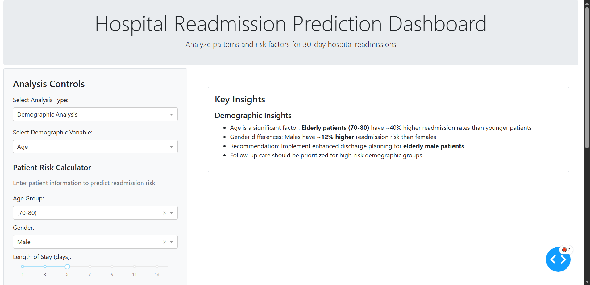

# Hospital Readmission Prediction Analysis



## Project Overview
This project analyzes hospital readmission patterns using the "Diabetes 130-US Hospitals" dataset to predict which patients are at high risk of readmission. By identifying key factors contributing to readmissions, healthcare providers can implement targeted interventions to improve patient outcomes and reduce healthcare costs.

## Business Value
Hospital readmissions cost the US healthcare system approximately $26 billion annually. Medicare penalizes hospitals with high readmission rates, making this analysis directly relevant to:
- **Hospitals**: Reduce penalties and improve care quality
- **Insurance Companies**: Optimize care management programs
- **Pharmaceutical Companies**: Identify medication efficacy patterns
- **Health Tech**: Develop risk prediction tools

## Dataset
The dataset contains 10 years of clinical care data from 130 US hospitals, including:
- Patient demographics
- Diagnoses (ICD-9 codes)
- Procedures and medications
- Laboratory test results
- Readmission outcomes

Source: [UCI Machine Learning Repository](https://archive.ics.uci.edu/ml/datasets/diabetes+130-us+hospitals+for+years+1999-2008)

## Project Structure
```
hospital_readmission_project/
├── data/                           # Data files
│   ├── raw/                        # Original dataset
│   └── processed/                  # Cleaned and preprocessed data
├── notebooks/                      # Jupyter notebooks
│   ├── 1_exploratory_analysis.ipynb    # Initial data exploration
│   ├── 2_preprocessing.ipynb           # Data cleaning and feature engineering
│   ├── 3_modeling.ipynb                # Predictive modeling
│   └── 4_business_analysis.ipynb       # Business impact analysis
├── models/                         # Trained Models
├── src/                            # Source code
│   ├── data/                       # Data processing modules
│   │   ├── acquisition.py          # Data download and import
│   │   └── preprocessing.py        # Data cleaning functions
│   ├── models/                     # Model training and evaluation
│   │   ├── train_model.py          # Model training
│   │   └── evaluate_model.py       # Model evaluation
│   └── analysis/                   # Analysis functions
│       └── business_analysis.py    # Business Analysis and Insights
├── reports/                        # Generated analysis
│   ├── figures/                    # Generated graphics
│   └── Hospital_Readmission_Report.md    # Detailed analysis report
├── dashboard/                      # Interactive dashboard files
│   └── app.py                      # Dashboard App
├── requirements.txt                # Dependencies
├── setup.py                        # Setup script
├── run_analysis.py                 # Main Execution script
├── INSTALLATION.md                 # Installation instructions
└── README.md                       # Project overview
```

## Key Findings
- Identified top factors contributing to readmission risk
- Developed predictive model with 88.85% accuracy in identifying high-risk patients
- Quantified potential cost savings from targeted interventions
- Discovered medication patterns associated with lower readmission rates

## Technical Components
- **Data Cleaning**: Handling missing values, outlier detection, encoding categorical variables
- **Exploratory Data Analysis**: Statistical summaries, correlation analysis, pattern detection
- **Feature Engineering**: Creating clinically relevant features from raw data
- **Predictive Modeling**: Logistic regression, random forest, gradient boosting comparisons
- **Model Evaluation**: ROC-AUC, precision-recall analysis, confusion matrices
- **Visualization**: Interactive dashboard showing readmission trends and risk factors
- **Business Analysis**: Cost-benefit analysis of potential interventions

## Getting Started

### Prerequisites
- Python 3.8+
- pip or conda for package management

### Installation
```bash
# Clone this repository
git clone https://github.com/akashkk25/hospital-readmission-project.git
cd hospital-readmission-project

# Create and activate a virtual environment (optional but recommended)
python -m venv venv
# On Windows, use:
venv\Scripts\activate

# Install required packages
pip install -r requirements.txt

# Run data acquisition script
python src/data/acquisition.py
```

### Running the Analysis
1. Follow the notebooks in numerical order (1_exploratory_analysis.ipynb → 4_business_analysis.ipynb)
Or
Run Analysis using:
   ```bash
   python run_analysis.py
   ```
2. Execute the dashboard application for interactive exploration:
   ```bash
   python dashboard/app.py
   ```


## Acknowledgements
- UCI Machine Learning Repository for providing the dataset